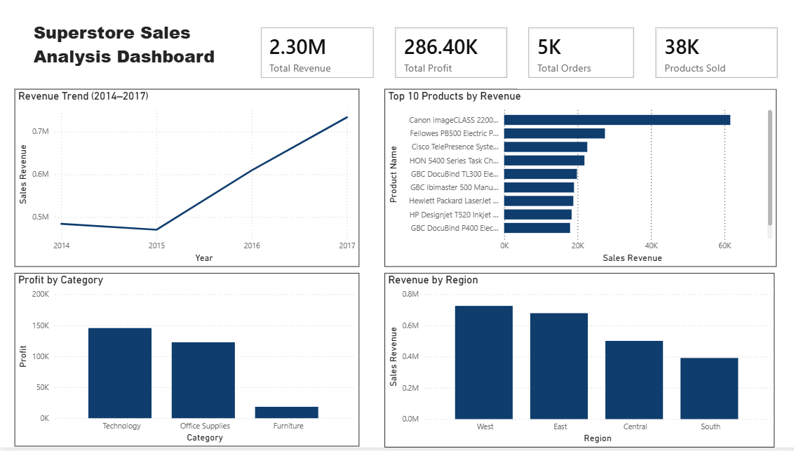

# 📊 FUTURE_DS_01: Business Sales Performance Analytics Dashboard

## 📌 Internship Information

| Details          | Information                          |
| ---------------- | ------------------------------------ |
| Internship Track | Data Science & Analytics             |
| Task Number      | Task 1                               |
| Task Name        | Business Sales Performance Analytics |
| Repository Name  | FUTURE_DS_01                         |
| Developed By     | Renuka Jyothi Sunkum                 |
| CIN ID           | FIT/JUN26/DS20503                    |

---

## 🧾 Project Overview

This project analyzes Superstore sales data using Power BI to identify revenue trends, top-performing products, profitable categories, and regional sales performance.

The dashboard transforms raw sales data into meaningful business insights to support data-driven decision-making.

---

## 🎯 Business Questions Answered

✅ Which products generate the most revenue?

✅ How do sales change over time?

✅ Which categories are most profitable?

✅ Which regions generate the highest sales?

✅ Where should the business focus to grow faster?

---

## 🛠️ Tools & Technologies Used

* Power BI
* CSV Dataset (Sample Superstore)
* DAX (Data Analysis Expressions)
* Data Visualization

---

## 📷 Dashboard Preview

---

## 📈 Key Performance Indicators (KPIs)

| KPI              | Value   |
| ---------------- | ------- |
| 💰 Total Revenue | 2.30M   |
| 📈 Total Profit  | 286.40K |
| 🛒 Total Orders  | 5K      |

---

## 📊 Key Insights

### 📈 Revenue Trend

* Revenue increased steadily from 2015 to 2017.
* 2017 recorded the highest sales performance.

📌 Business Impact:

* Indicates growing business demand.
* Similar sales strategies can be continued to sustain growth.

---

### 🏆 Top Revenue-Generating Products

* Canon imageCLASS 2200 generated the highest revenue.
* A small number of products contribute significantly to total sales.

📌 Business Impact:

* Maintain inventory for top-performing products.
* Focus marketing efforts on high-revenue products.

---

### 💻 Most Profitable Categories

* Technology generated the highest profit.
* Office Supplies showed consistent performance.
* Furniture generated the lowest profit.

📌 Business Impact:

* Expand Technology product offerings.
* Improve profitability of Furniture products.

---

### 🌎 Regional Sales Performance

* West region recorded the highest sales.
* East region was the second-best performer.
* South region generated the lowest sales.

📌 Business Impact:

* Continue investing in West and East regions.
* Increase promotions in South region to improve growth.

---

### 🚀 Business Growth Opportunities

* High-performing regions and profitable categories present growth opportunities.

📌 Business Impact:

* Focus on Technology products.
* Expand successful sales strategies to underperforming regions.

---

## 💡 Business Recommendations

* Invest more in high-performing regions.
* Increase focus on Technology category products.
* Promote top-selling products through targeted campaigns.
* Improve sales performance in lower-performing regions.
* Monitor yearly revenue trends for future planning.

---

## 📂 Repository Structure

FUTURE_DS_01/

├── dashboard/

│ ├── task-1.pbix

│ └── dashboard.png

├── dataset/

│ └── Sample-Superstore.csv

├── insights/

│ └── key_insights.md

└── README.md

---

## 📚 Skills Gained

* Business Analytics
* KPI Analysis
* Dashboard Development
* Power BI Visualization
* DAX Calculations
* Insight Generation
* Business Reporting

---

## 🚀 Project Outcome

✔ Developed an interactive Power BI dashboard

✔ Identified revenue trends and business opportunities

✔ Generated actionable business insights

✔ Supported data-driven decision-making

✔ Created a portfolio-ready analytics project

---

## 👨‍💻 Author

**Renuka Jyothi Sunkum**

BCA Student | Data Science & Analytics Intern

Koneru Lakshmaiah Education Foundation (KLH University)

---

## ⭐ Acknowledgement

This project was completed as part of the Future Interns Data Science & Analytics Internship Program.
